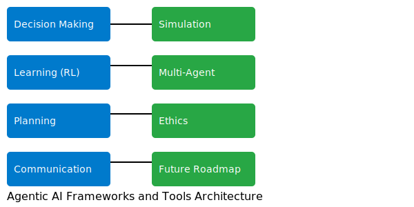

# Agentic AI Frameworks and Tools Repository

This repository serves as a comprehensive resource for the research, development, and deployment of agentic AI systems. It contains deep knowledge documents, structured QnA resources, white papers, strategic roadmaps, and implementation examples covering agentic AI frameworks, reinforcement learning integration, multi-agent systems, ethical considerations, and future initiatives.

## Overview

Agentic AI represents a new frontier in artificial intelligence where systems operate as autonomous agents. This repository includes:

- **Deep Knowledge Document:** A detailed exploration of agentic AI frameworks and tools.
- **QnA Knowledge Base:** Structured QnA data for IBM InstructLab.
- **White Papers & Research:** Current and upcoming publications on ethical AI, hybrid architectures, and more.
- **Roadmaps & Future Initiatives:** Strategic insights into near-, mid-, and long-term directions for agentic AI.
- **Example Projects:** Sample code and demonstration projects showcasing practical implementations.

## Architecture Diagram

Below is an SVG diagram illustrating the high-level architecture of agentic AI frameworks and tools:

